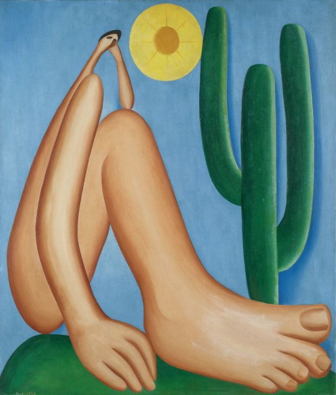
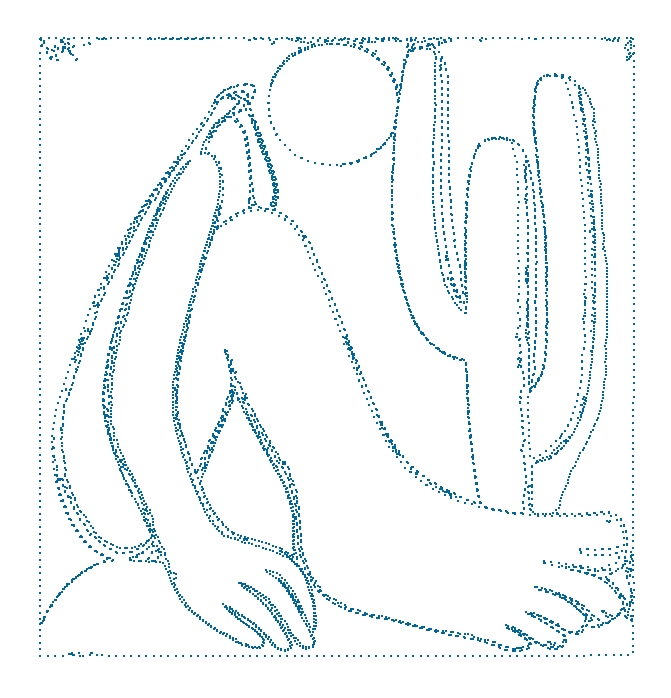
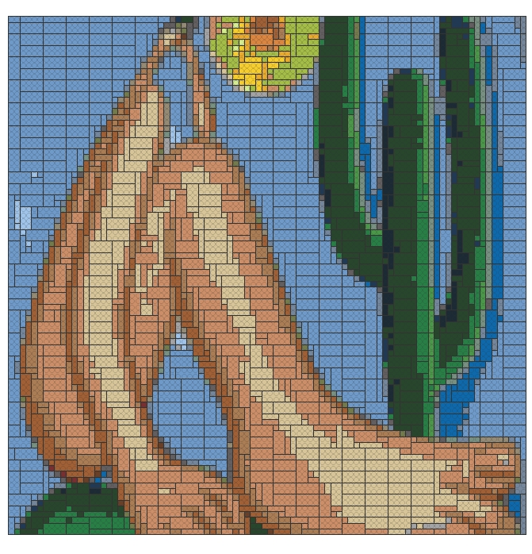

 

Dicas, páginas interessantes, conteúdo informativo... tudo que envolve R, estatística, aprendizado de máquina e diversão será compartilhado nesta página.

Aproveitem! <i class="far fa-smile-wink"></i>

<h3>R/RStudio</h3>
 

<h4>Análise Exploratória dos Dados</h4>
Você sabia que o R possui pacotes que realizam uma análise exploratória dos dados de maneira automática?
Ao rodar as funções especializadas para isso, ele gera relatórios em HTML ou PDF que auxiliam a visualizar os tipos de variáveis, a existência de dados ausentes, dentre outras características.
Aproveite o [script](https://drive.google.com/file/d/1kw2owUmfzqV3ZJeUIdXrOkKia0CObO1q/view?usp=sharing) e faça a sua própria análise!
 

***

<h4>Cheet Sheets</h4>
As <i>cheet sheets</i> abaixo facilitam o aprendizado e o uso de alguns dos pacotes do R/RStudio. Todas elas foram obtidas por meio deste [link](https://www.rstudio.com/resources/cheatsheets/).
 
 

<ul class="fa-ul">
<li><i class="far fa-file"></i> [Comandos Básicos do R](http://github.com/rstudio/cheatsheets/raw/master/base-r.pdf)</li>
<li><i class="far fa-file"></i> Aprendizado de Máquina [1](https://github.com/rstudio/cheatsheets/raw/master/caret.pdf) [2](https://github.com/rstudio/cheatsheets/raw/master/Machine%20Learning%20Modelling%20in%20R.pdf) [3](https://github.com/rstudio/cheatsheets/raw/master/mlr.pdf)</li>
<li><i class="far fa-file"></i> [RMarkdown](https://github.com/rstudio/cheatsheets/raw/master/rmarkdown-2.0.pdf)</li>
<li><i class="far fa-file"></i> [RStudio IDE](https://github.com/rstudio/cheatsheets/raw/master/rstudio-ide.pdf)</li>
<li><i class="far fa-file"></i> [Shiny](https://github.com/rstudio/cheatsheets/raw/master/shiny.pdf)</li>
<li><i class="far fa-file"></i> [Visualização de Dados](https://github.com/rstudio/cheatsheets/raw/master/data-visualization-2.1.pdf)</li>
</ul>

***

<h4>Diversão</h4>

Jogue e crie memes com o R. Abaixo você encontra alguns scripts com os pacotes e as funções necessárias para se divertir!
 
 

<ul class="fa-ul">
<li><i class="fas fa-puzzle-piece"></i> Jogos: [Script](https://drive.google.com/file/d/1UXRrFCFp1ECUrQXqdEatddNDI6jGJNHY/view?usp=sharing)</li>
<li><i class="fas fa-puzzle-piece"></i> Memes: [Script](https://drive.google.com/file/d/1LzilvO4Jny6kYw-8A3YiqV4cebhsgSMl/view?usp=sharing)</li>
</ul>

***

<h4>Gráficos</h4>
Os links abaixos apresentam páginas, pacotes ou *scripts* voltados para a contrução de gráficos no R.
 
 

<ul class="fa-ul">
<li><i class="fas fa-chart-bar"></i> [Esquisse](https://dreamrs.github.io/esquisse/): add-in do RStudio que permite a contrução de gráficos por meio do pacote ggplot2 sem a necessidade de linhas de comando.</li>
<li><i class="fas fa-chart-bar"></i> [from Data to Viz](https://www.data-to-viz.com/): árvore de decisão que leva a um conjunto de visualizações potencialmente apropriadas para representar seu conjunto de dados via R.</li>
<li><i class="fas fa-chart-bar"></i> [Plotly](https://plot.ly/r/): pacote do R para desenvolvimento de gráficos iterativos.</li>
<li><i class="fas fa-chart-bar"></i> [Temas para o ggplot2](https://drive.google.com/file/d/1gF96iNDtaPT-_QO5GkzEhg2mPbTmE97Y/view?usp=sharing): script contendo diversos temas diferentes para deixar os gráficos criados com o pacote ggplot2 mais bonitos.
</li>
<li><i class="fas fa-chart-bar"></i> [The R Graph Gallery](https://www.r-graph-gallery.com/): projeto desenvolvido por Yan Holtz para promover a visualização de dados usando o R. A idéia do site é fornecer centenas de gráficos R, sempre com o código reproduzível associado.</li>
</ul>

***

<h4>Imagens</h4>

Transforme suas fotos em imagens interessantes no R. Abaixo estão alguns exemplos e os scripts necessários para realizar a transformação.
 
 

<ul class="fa-ul">
<li><i class="fas fa-file-image"></i> Imagem como gráfico de pontos: [Script](https://drive.google.com/file/d/1dQvQL_5bHv5iJekauarLuvx1hvr9xa83/view?usp=sharing)</li>
<li><i class="fas fa-file-image"></i> Imagem com Lego: [Script](https://drive.google.com/file/d/1k9QCe6uuWkYa2JUM3LkbzFLKoNuSyeFi/view?usp=sharing)</li>
</ul>
 

**Exemplo**: Abaporu: pintura a óleo da artista brasileira Tarsila do Amaral. Na Figura 1 vemos a imagem original, na Figura 2, uma imagem feita com pontos, e na Figura 3, uma imagem feita com Legos.
 
 

 
 

Aproveite os scripts e faça a sua própria arte!

***

<h4>Materiais Didáticos</h4>

Nesta lista temos diversos <i>links</i> com materiais didáticos voltados para o ensino do R.

<ul class="fa-ul">
<li><i class="fas fa-book"></i> [Coleção de livros gratuitos sobre a linguagem de programação R e ciência de dados.](https://committedtotape.shinyapps.io/freeR/)</li>
<li><i class="fas fa-book"></i> [Xícara de chá, girafas e estatística - ensino de estatística de forma divertida usando o R.](https://tinystats.github.io/teacups-giraffes-and-statistics/index.html)
</ul>
***

<h4>Página Pessoal</h4>

Já pensou em fazer sua página pessoal usando o software R? Com este [tutorial](https://drive.google.com/file/d/1YTQgzt0sLPZ2aBME-nw2Agmy1NvM89M3/view?usp=sharing) você tem acesso a um material prático com todo o passo-a-passo necessário.

