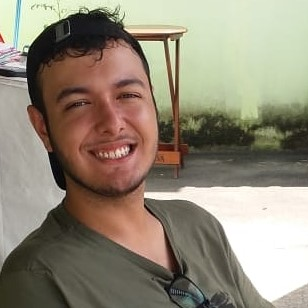

 

#### Desenvolvimento de ferramentas de apoio ao ensino de Bioestatística com técnicas de gamificação
 

**Aluno: Gabriel Fernandes de Sousa**
 

Ao longo dos anos, foi possível observar uma mudança contínua nas abordagens pedagógicas. O principal objetivo dessas transformações é acompanhar o perfil comportamental dos alunos contemporâneos, a fim de facilitar e melhorar o processo de ensino-aprendizagem. Aulas tradicionais, centradas em um modelo passivo/expositivo, não atraem o estudante de hoje, contribuindo apenas para a desmotivação dos alunos. 
Na Unirio, desde 2012, o ensino de Bioestatística tem centrado o ensino na figura do aluno, formulado por meio do uso de metodologias ativas a fim de buscar o interesse e, principalmente, a motivação dos alunos.
Apesar dos esforços já aplicados, novas metodologias ativas vêm surgindo e ganham espaço dentro das salas de aulas; dentre elas, pode-se citar a gamificação, que vem ganhando destaque devido à sua capacidade de envolver, engajar e motivar a ação do estudante em ambientes de aprendizagem.
A gamificação, tanto analógica (baralhos, tabuleiros) quanto digital, utiliza a dinâmica de games em contextos fora dos jogos para motivar, aumentar a atividade e reter a atenção do usuário, tornando o aprendizado mais leve e atrativo. Inserir essa prática no ensino de Bioestatística será mais uma ferramenta de apoio pedagógico, permitindo a aplicação de atividades mais dinâmicas, bem como a participação efetiva dos alunos. Dessa forma, é essencial a participação de monitores atuando não só nas tradicionais atividades de acompanhamento e apoio aos discentes e preparação de materiais didáticos, mas também no desenvolvimento desses jogos educativos. O monitor, por já ter passado pelo papel de estudante do curso de Bioestatística, apresenta maior propriedade para fornecer melhores ideias e estratégias que despertarão o interesse do aluno. Dessa forma, o principal objetivo deste projeto é o desenvolvimento de ferramentas de apoio ao ensino de Bioestatística com técnicas de gamificação.

 
 

 

#### O papel do monitor na facilitação do ensino do software R no curso de Estatística
 

**Aluno: João Yago Rodrigues da Silva**
 
*Lattes*: <http://lattes.cnpq.br/0674143103616507>

 

O avanço da tecnologia em sala de aula tem contribuído para proporcionar percursos mais modernos de aprendizagem aos alunos e permitir aos professores experimentar novas possibilidades de ensino. Essa realidade pode ser observada nos cursos de estatística, em que o método tradicional de cálculo de medidas-resumo e de testes de hipóteses na mão passa a ser realizado por meio de softwares estatísticos. Dessa forma, sai um ensino massivo ou com uso excessivo de fórmulas, entra um ensino com aplicações, voltado para a interpretação dos dados e conhecimento funcional das técnicas estatísticas de análises.
O uso de softwares estatísticos é de grande importância no que se refere à análise e à interpretação de resultados. Dentre eles, destaca-se o R, ferramenta de domínio público e livre, amplamente utilizado na análise e manipulação de dados, com testes paramétricos e não paramétricos, modelagem linear e não linear, entre outros, apresentando facilidade na elaboração de diversos tipos de gráficos, importantes na análise exploratória dos dados.
Apesar do fácil acesso à ferramenta, muitos alunos de cursos de áreas não exatas mostram uma aversão inicial à ideia de usar o software, pois requer um raciocínio lógico e de programação. Para contornar essa situação, o apoio de monitores, atuando fora do horário das aulas, pode proporcionar uma melhor assimilação do conteúdo, além de realçar a importância e a necessidade de aprender tal ferramenta. O monitor, que já foi um aluno da disciplina, tem um amadurecimento maior e poderá repassar a importância de se conhecer a ferramenta aos demais estudantes.Dessa forma, o principal objetivo deste projeto é oferecer uma monitoria focada na utilização do R como software de apoio às análises estatísticas.

