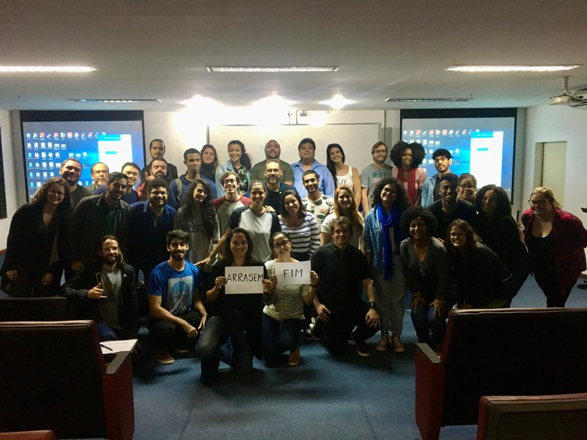

 
<h5>Encerramento da disciplina de Bioestatística da turma de Biologia e Biomedicina de 2019.1</h5>

  
  

  

 

<h5>Encerramento da disciplina de Bioestatística da turma de Biologia e Biomedicina de 2019.2</h5>

  
  

  

 

<h5>Encerramento da disciplina de Bioestatística da turma de Ciências Ambientais/Biológicas/da Natureza de 2019.1</h5>

  
  

  

 

<h5>Apresentação do postêr de monitoria pela aluna Juliana Marinho. O pôster foi premiado como melhor trabalho de monitoria da JIC, Rio de Janeiro, 2019</h5>

  
  

  

<h5>Defesa do TCC de Dhara Avelino, Rio de Janeiro, 2019</h5>

  
  

  

<h5>Apresentação do trabalho desenvolvido na disciplina de Bioestatística no IV Encontro de Educação Estatística, Rio de Janeiro, 2019</h5>
<h5>Alunos: Ádamis Gonçalves e Vinicius Bauer</h5>

  
  

  

<h5>Apresentação do trabalho desenvolvido na disciplina de Bioestatística no IV Encontro de Educação Estatística, Rio de Janeiro, 2019</h5>
<h5>Alunas: Amanda Lanna, Izadora Queiroz e Júlia Cardoso</h5>

  
  

  

